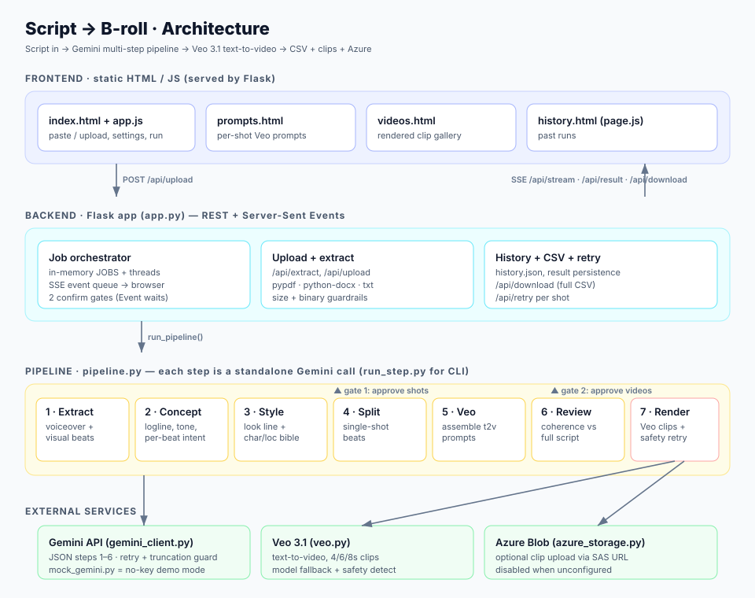

# Script → B-roll · Cinematic Prompt Studio

Turn any narration script into a set of **consistent, ready-to-shoot Veo 3.1 video prompts** — and optionally render the B-roll clips themselves.

Paste or upload a script (`.txt`, `.md`, `.pdf`, `.docx`). A multi-step Gemini pipeline extracts the beats, distils the concept, designs a locked cinematic look and character/location bible, splits the visuals into single-shot beats, writes one text-to-video prompt per shot, and reviews every prompt against the whole story for coherence. You review the shot breakdown, confirm, and (optionally) render each shot with Veo 3.1, uploading the clips to Azure Blob Storage. Everything is exportable as a CSV.

---

## What it does

- **Script → structured beats.** Splits narration into voiceover + on-screen visual pairs.
- **Concept understanding.** Logline, theme, tone, genre, and the *intent* behind each visual.
- **Cinematic consistency engine.** A single verbatim "Look Line" plus locked identity/location blocks are pasted into every prompt, so the same face, wardrobe, and setting recur across independently-generated clips (Veo has no memory between generations — all consistency lives in the words).
- **Single-shot splitting.** Multi-action visuals are broken into one continuous shot each.
- **Veo 3.1 text-to-video prompts.** One photoreal, grounded prompt per shot with a tight realism negative folded in.
- **Visual-coherence review.** With the full script in context, each prompt is checked for "does this actually make sense for the story?" and rewritten if it drifted — while keeping the locked look/identity blocks intact.
- **Optional rendering.** Generate Veo clips per shot, with a **safety-retry** pass that rewrites prompts (up to 2×) to clear the content guardrail before giving up.
- **Azure upload + CSV export + run history.**
- **Demo mode.** Drive the entire UI and pipeline with canned data — **no API key required**.

---

## Architecture



The system is four layers:

1. **Frontend** — static HTML/JS (no build step), served directly by Flask. The main page submits the script and streams live progress; separate pages show the prompts, the rendered videos, and run history.
2. **Backend** — a single Flask app (`app.py`) exposing REST endpoints plus a Server-Sent Events stream. It owns job state (in-memory + persisted), the two human-in-the-loop confirm gates, upload/extraction, CSV export, and per-shot retry.
3. **Pipeline** — `pipeline.py`, six Gemini-backed steps. Each step is a standalone, individually testable function; `run_pipeline()` chains them for the web app, and `run_step.py` runs any single step from the CLI.
4. **External services** — the Gemini API (all LLM steps), Veo 3.1 (text-to-video), and optional Azure Blob Storage. A `MockGemini` stands in for Gemini in demo mode.

### The pipeline steps

| # | Step | What it produces |
|---|------|------------------|
| 1 | **Extract** | Ordered beats: `{voiceover, visual}` per beat. |
| 2 | **Concept** | Logline, summary, theme, tone, genre + per-beat *intent*. |
| 3 | **Style & bible** | A verbatim **Look Line**, plus locked **identity blocks** (one outfit per character, no invented facial marks) and **location blocks**. |
| 4 | **Split** | Each visual broken into single-shot beats, with full story context. |
| 5 | **Veo prompts** | One assembled text-to-video prompt per shot: Look Line + location block + identity block(s) + shot body + realism close + folded negative. |
| 6 | **Review** | Coherence check of every shot against the *whole* script; drifted shot bodies are rewritten and re-assembled, locked blocks untouched. |
| 7 | **Render** *(optional)* | Veo 3.1 clip(s) per shot, in batched waves, with a safety-rewrite retry pass; clips optionally uploaded to Azure. |

Two **confirm gates** pause for human approval: gate 1 after the shot split (before spending tokens on prompts), gate 2 before rendering (before spending on video).

---

## Repository layout

```
script_to_broll/
├── backend/
│   ├── app.py              # Flask app: REST + SSE, jobs, gates, upload, CSV, history
│   ├── pipeline.py         # The 6 LLM steps + prompt assembly + review + sanitize
│   ├── gemini_client.py    # Gemini wrapper: JSON mode, retries, truncation guard
│   ├── mock_gemini.py      # Canned responses for demo mode (no API key)
│   ├── veo.py              # Veo 3.1 text-to-video calls + model fallback + safety detect
│   ├── azure_storage.py    # Optional Azure Blob upload (SAS URL or connection string)
│   ├── config.py           # All env-driven configuration
│   ├── run_step.py         # CLI harness to run/test one step at a time
│   ├── fixtures/           # Sample script for testing
│   └── generated/          # Runtime output: clips, job state, history (git-ignored)
├── frontend/
│   ├── index.html / app.js / style.css   # Main studio UI
│   ├── prompts.html        # Per-shot prompt viewer
│   ├── videos.html         # Rendered clip gallery
│   ├── history.html / page.js            # Past runs
├── docs/
│   └── architecture.svg    # The diagram above
├── requirements.txt
├── .env.example            # Copy to .env and fill in
└── .gitignore
```

### Module responsibilities

- **`app.py`** — HTTP surface and orchestration. Spawns a thread per job, streams `step`/`confirm`/`complete`/`error` events over SSE, blocks on `threading.Event` gates for the two confirmations, extracts text from uploads, renders clips in waves, runs the safety-retry pass, persists results + history, and serves the CSV.
- **`pipeline.py`** — the brains. Holds the realism negative/close strings, the grounding + face rules, and the six steps. Key helpers: `_assemble_veo_prompt` (verbatim block injection), `_lookup_block` (tolerant character/location matching so blocks still inject on near-miss labels), `step5b_review` (coherence pass), `sanitize_prompt` (rewrite a safety-blocked prompt while keeping locked blocks).
- **`gemini_client.py`** — wraps `google-genai`. Forces JSON output, sets a generous `max_output_tokens` (the default model is a *thinking* model whose reasoning shares the output budget), retries transient errors, and raises a clear error on `MAX_TOKENS` truncation.
- **`veo.py`** — submits text-to-video jobs, falls back across model IDs, drops API-unsupported fields (the Developer API rejects `seed`/`negative_prompt`), and classifies safety blocks.
- **`azure_storage.py`** — uploads finished clips when an Azure SAS URL (or connection string) is set; cleanly disabled otherwise.
- **`config.py`** — every tunable, read from `.env`.

---

## Getting started

### Prerequisites

- **Python 3.10+** (3.12 recommended)
- A **Gemini API key** for real runs — get one at <https://aistudio.google.com/apikey>. (Demo mode needs no key.)
- Veo 3.1 is a **paid** feature on the same key; rendering clips incurs cost.
- *(Optional)* An Azure Blob Storage container + SAS URL to store rendered clips.

### 1. Clone & create a virtualenv

```bash
git clone https://github.com/prajwal3232/script-to-broll-veo.git
cd script-to-broll-veo
python3 -m venv venv
source venv/bin/activate           # Windows: venv\Scripts\activate
pip install -r requirements.txt
```

### 2. Configure environment

```bash
cp .env.example .env
```

Edit `.env` and set at least `GEMINI_API_KEY`. Leave the Azure values blank to disable upload. **Never commit `.env`** — it is git-ignored.

### 3. Run the server

```bash
python backend/app.py
```

Then open **<http://127.0.0.1:5000>**.

> The server runs with Flask's reloader (`debug=True`), so editing any `.py` file restarts it automatically.

### 4. Try it without a key (demo mode)

Click **Run demo** in the UI, or append `?demo=1`. The whole pipeline runs on canned data — useful for exploring the UI and the flow before spending on the API.

---

## Using the app

1. **Paste** a script or **Upload** a `.txt`, `.md`, `.pdf`, or `.docx` file (PDFs/Word docs are parsed to text server-side; legacy `.doc` is not supported — save as `.docx`/`.pdf`/`.txt`).
2. Pick **aspect ratio** (9:16 / 16:9), **outputs per shot** (1–4), and the **Veo model**.
3. Click **Generate shots**. Watch the pipeline stream through steps 1–6.
4. **Gate 1** — review the shot breakdown, then confirm to write prompts.
5. **Gate 2** — review how many clips will be generated, then confirm to render (or stop here with prompts only).
6. Open **View prompts**, **View videos**, or **Download CSV**.

### CSV columns

`id`, `source_beat`, `voiceover`, `visual_extracted`, `updated_visual`, `location`, `characters`, `veo_prompt`, `visual_review_note`, `veo_duration_s`, `azure_broll_path`.

The `visual_review_note` column carries the step-6 reviewer's note; shots the reviewer rewrote are prefixed `[corrected]`.

---

## CLI: run a single step

`run_step.py` lets you run and inspect each pipeline step in isolation, reading/writing a shared JSON state file.

```bash
cd backend
# Seed state with a script and run step 1
python run_step.py 1 --script-file fixtures/sample_script.txt --state /tmp/s.json
# Run the rest, each reading the growing state file
python run_step.py 2 --state /tmp/s.json
python run_step.py 3 --state /tmp/s.json
python run_step.py 4 --state /tmp/s.json
python run_step.py 5 --state /tmp/s.json
python run_step.py 6 --state /tmp/s.json

# Exercise the wiring with no API key:
python run_step.py 1 --script "A lone lighthouse..." --state /tmp/s.json --mock
```

You can hand-edit the state JSON between steps to test a step with custom inputs.

---

## REST API

| Method & path | Purpose |
|---|---|
| `POST /api/extract` | Extract plain text from an uploaded PDF/Word/text file (for the editor). |
| `POST /api/upload` | Submit a script (JSON or multipart file); starts a job, returns `job_id`. |
| `GET /api/stream/<job_id>` | Server-Sent Events: live `step` / `confirm` / `complete` / `error`. |
| `GET /api/result/<job_id>` | The current/last result for a job. |
| `POST /api/confirm/<job_id>` | Release a confirm gate (`{"proceed": true}` / prompts vs videos). |
| `POST /api/retry/<job_id>/<shot_id>` | Re-render a single failed shot. |
| `GET /api/download/<job_id>` | Download the full CSV. |
| `GET /api/jobs` | Recent run history. |
| `POST /api/step/<n>` | Run a single pipeline step from a JSON payload. |
| `GET /api/steps` | Step titles + required inputs. |
| `GET /api/health` | Key/model/Azure status used by the UI. |
| `GET /` · `/prompts` · `/videos` · `/history` | Frontend pages. |

---

## Configuration reference

All set in `.env` (see `.env.example`):

| Variable | Default | Notes |
|---|---|---|
| `GEMINI_API_KEY` | — | Required for real runs. |
| `GEMINI_MODEL` | `gemini-3.1-pro-preview` | LLM for steps 1–6. |
| `GEMINI_MAX_OUTPUT_TOKENS` | `32768` | Generous, because the default model is a *thinking* model (reasoning shares the output budget). |
| `VEO_MODEL` | `veo-3.1-lite-generate-preview` | Lite/Fast/Quality, Veo 3.0/3.1 — see `config.py`. |
| `VEO_ASPECT_RATIO` | `9:16` | `9:16` or `16:9`. |
| `VEO_USE_SEED` | off | Only works on Vertex AI; the Developer API rejects `seed`. |
| `VEO_BATCH_SIZE` / `VEO_BATCH_DELAY` | `10` / `10` | Render throughput: wave size and delay between waves. |
| `VEO_MAX_VIDEOS_PER_RUN` | `50` | Hard ceiling per run to bound cost. |
| `MAX_SCRIPT_CHARS` | `20000` | ~10 pages; larger uploads are rejected. |
| `HOST` / `PORT` | `127.0.0.1` / `5000` | Server bind. |
| `AZURE_BLOB_SAS_URL` | — | Preferred Azure target; blank disables upload. |
| `AZURE_BLOB_PREFIX` | `hogel-brolls/testing` | Folder prefix inside the container. |
| `AZURE_STORAGE_CONNECTION_STRING` / `AZURE_STORAGE_CONTAINER` | — | Fallback Azure auth. |

---

## Sharing a local server (public link)

The server binds to `localhost` by default. To expose it temporarily with a [Cloudflare quick tunnel](https://developers.cloudflare.com/cloudflare-one/connections/connect-networks/do-more-with-tunnels/trycloudflare/) (no account needed):

```bash
cloudflared tunnel --url http://localhost:5000
```

It prints a public `https://<random>.trycloudflare.com` URL.

---

## Notes & limitations

- **Text-only consistency.** Veo Fast/Lite clips are generated independently with no shared reference frame, so all continuity is carried by the verbatim Look Line and identity/location blocks. Paraphrasing those blocks is the #1 cause of drift — the pipeline keeps them verbatim.
- **Grounding.** The pipeline is instructed to describe only what the script states or directly implies, and **never** to invent facial marks (scars, moles, tattoos, etc.); wardrobe is locked to a single plausible outfit per character for consistency.
- **Cost.** Rendering is gated behind an explicit confirmation and capped by `VEO_MAX_VIDEOS_PER_RUN`. Prompt-only runs cost only the LLM steps.
- **Scanned PDFs** (images, no text layer) can't be extracted — paste the text or use a text-based PDF.
